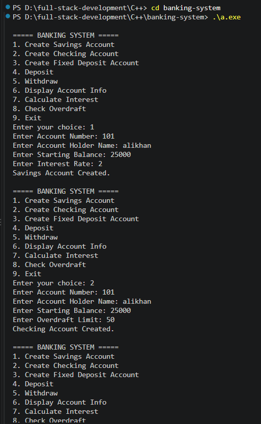
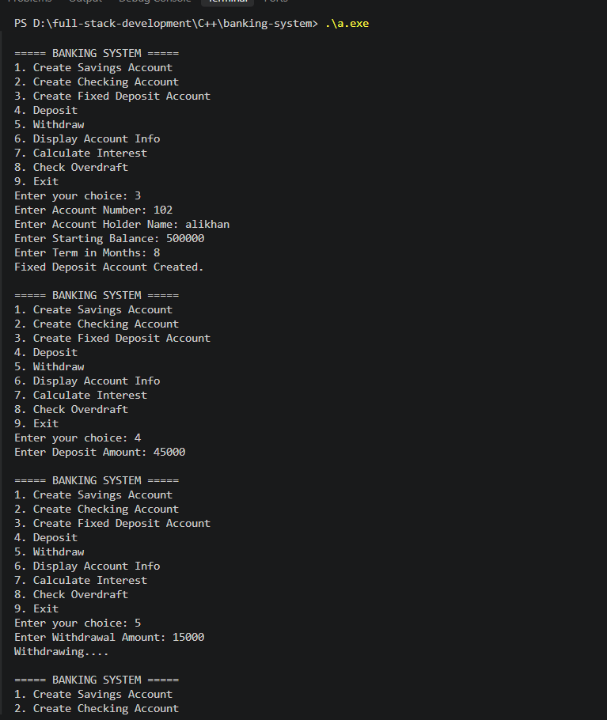
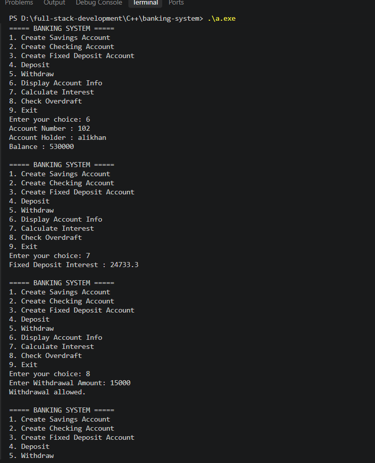
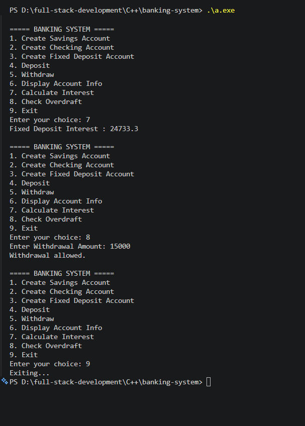

# 🔵 Banking System — C++ OOP Banking Management Project

> **Shaping "Skills" for "Scaling" Higher...!!!**

## 📌 Project Description

This project is a **Banking System developed in C++** using **Object-Oriented Programming (OOP)** concepts.

The objective of this project is to understand and demonstrate how classes, objects, inheritance, virtual functions, function overriding, pointers, and dynamic memory allocation can be used to build a menu-driven banking application.

The project contains **3 different account types**:

* Savings Account
* Checking Account
* Fixed Deposit Account

The system also provides operations such as **Deposit, Withdraw, Display Account Information, Calculate Interest, and Check Overdraft**.

---

## 🎯 Objectives

* Understand the fundamentals of Object-Oriented Programming in C++.
* Learn how to create base and derived classes.
* Understand inheritance between banking account classes.
* Practice virtual functions and function overriding.
* Learn how pointers can reference derived class objects.
* Understand dynamic memory allocation using `new` and `delete`.
* Perform deposit and withdrawal operations.
* Calculate interest for Savings and Fixed Deposit accounts.
* Check overdraft limits for Checking accounts.
* Develop a menu-driven console application.
* Improve logical thinking and problem-solving skills.

---

## 🛠️ Technology Used

* **C++ Language**
* **Object-Oriented Programming (OOP)**
* **Classes & Objects**
* **Inheritance**
* **Encapsulation**
* **Virtual Functions**
* **Function Overriding**
* **Pointers**
* **Dynamic Memory Allocation**
* **Switch-Case**
* **Do-While Loop**
* **Visual Studio Code**
* **Git & GitHub**

---

# 📚 Problem Statements

## Q1. Bank Account Base Class

### Problem Statement

Develop a base **BankAccount class** that stores common account information.

The class stores:

* Account Number
* Account Holder Name
* Account Balance

It also provides functions to deposit money, withdraw money, display account information, and define a virtual function for interest calculation.

### Concept Used

* Class and Object
* Encapsulation
* Private Data Members
* Constructor
* Getter Methods
* Deposit Function
* Withdraw Function
* Virtual Function

---

## Q2. Savings Account

### Problem Statement

Develop a **SavingsAccount class** by inheriting the `BankAccount` class.

The Savings Account stores an additional **Interest Rate** and calculates interest based on the current balance.

### Formula Used

```text
Interest = Balance × (Interest Rate / 100)
```

### Concept Used

* Single Inheritance
* Derived Class
* Constructor
* Virtual Function
* Function Overriding
* Interest Calculation

---

## Q3. Checking Account

### Problem Statement

Develop a **CheckingAccount class** by inheriting the `BankAccount` class.

The Checking Account stores an **Overdraft Limit** and checks whether a requested withdrawal amount is within the available balance plus overdraft limit.

### Condition Used

```text
Withdrawal Amount <= Balance + Overdraft Limit
```

If the condition is true:

```text
Withdrawal allowed.
```

Otherwise:

```text
Overdraft limit exceeded.
```

### Concept Used

* Single Inheritance
* Derived Class
* Constructor
* Overdraft Limit
* Conditional Statement
* Balance Checking

---

## Q4. Fixed Deposit Account

### Problem Statement

Develop a **FixedDepositAccount class** by inheriting the `BankAccount` class.

The Fixed Deposit Account stores the **Term in Months** and calculates interest using a fixed interest rate of **7%**.

### Formula Used

```text
Interest = Balance × (7 / 100) × (Term / 12)
```

### Concept Used

* Single Inheritance
* Derived Class
* Constructor
* Virtual Function
* Function Overriding
* Fixed Interest Rate
* Term-Based Interest Calculation

---

# ⚙️ Banking System Operations

## 1. Create Savings Account

The user enters:

```text
Account Number
Account Holder Name
Starting Balance
Interest Rate
```

After successful creation:

```text
Savings Account Created.
```

---

## 2. Create Checking Account

The user enters:

```text
Account Number
Account Holder Name
Starting Balance
Overdraft Limit
```

After successful creation:

```text
Checking Account Created.
```

---

## 3. Create Fixed Deposit Account

The user enters:

```text
Account Number
Account Holder Name
Starting Balance
Term in Months
```

After successful creation:

```text
Fixed Deposit Account Created.
```

---

## 4. Deposit

The user enters a deposit amount and the amount is added to the current account balance.

### Concept Used

* Member Function
* Arithmetic Operation
* Object Pointer

---

## 5. Withdraw

The user enters a withdrawal amount.

If sufficient balance is available, the amount is deducted from the account balance.

```text
Withdrawing....
```

If sufficient balance is not available:

```text
Not enough Balance...
```

### Concept Used

* Conditional Statement
* Member Function
* Balance Validation

---

## 6. Display Account Information

The system displays:

```text
Account Number
Account Holder
Balance
```

### Concept Used

* Getter Methods
* Member Function
* Data Display

---

## 7. Calculate Interest

The system calls the virtual `calculateInterest()` function through the `BankAccount` pointer.

For a Savings Account, interest is calculated using the user-entered interest rate.

For a Fixed Deposit Account, interest is calculated using the fixed **7% rate** and the selected term.

### Concept Used

* Virtual Function
* Function Overriding
* Runtime Polymorphism

---

## 8. Check Overdraft

The overdraft feature is available for a **Checking Account**.

The program checks whether the requested withdrawal amount is less than or equal to the account balance plus overdraft limit.

### Concept Used

* Checking Account
* Conditional Statement
* Overdraft Limit

---

## 9. Exit

The user can select option `9` to terminate the program.

```text
Exiting...
```

---

# 🖥️ Main Menu

```text
===== BANKING SYSTEM =====
1. Create Savings Account
2. Create Checking Account
3. Create Fixed Deposit Account
4. Deposit
5. Withdraw
6. Display Account Info
7. Calculate Interest
8. Check Overdraft
9. Exit

Enter your choice:
```

---

# 📸 Output Section

## Output 1 — Savings Account

### Output Screenshot



---

## Output 2 — Checking Account

### Output Screenshot



---

## Output 3 — Fixed Deposit Account

### Output Screenshot



---

## Output 4 — Banking Operations

### Output Screenshot



---

# 📂 Project Structure

```text
banking-system/
│
├── banking-system.cpp
│
├── output/
│   ├── output1.png
│   ├── output2.png
│   ├── output3.png
│   └── output4.png
│
└── README.md
```

---

# 🧠 OOP Concepts Implemented

## Encapsulation

The `BankAccount` class stores Account Number, Account Holder Name, and Balance as private data members.

Public member functions are used to access and modify account information.

---

## Inheritance

The project uses inheritance to create different account types from the common `BankAccount` base class.

```text
BankAccount
    │
    ├── SavingsAccount
    │
    ├── CheckingAccount
    │
    └── FixedDepositAccount
```

---

## Virtual Function

The `BankAccount` class contains:

```cpp
virtual void calculateInterest()
{
}
```

This function is overridden by Savings Account and Fixed Deposit Account.

---

## Function Overriding

Both `SavingsAccount` and `FixedDepositAccount` provide their own implementation of `calculateInterest()`.

This allows different interest calculations for different account types.

---

## Runtime Polymorphism

A base class pointer is used:

```cpp
BankAccount *account = nullptr;
```

The pointer can reference Savings, Checking, or Fixed Deposit account objects.

When `calculateInterest()` is called through this pointer, the appropriate overridden function is executed for supported derived account types.

---

## Dynamic Memory Allocation

Objects are dynamically created using the `new` keyword:

```cpp
savings = new SavingsAccount(...);
checking = new CheckingAccount(...);
fixed = new FixedDepositAccount(...);
```

At the end of the program, allocated objects are released using:

```cpp
delete savings;
delete checking;
delete fixed;
```

---

# 💡 Learning Outcomes

After completing this project, I learned:

* How classes and objects work in C++.
* How to implement encapsulation using private data members.
* How constructors initialize account objects.
* How inheritance provides code reusability.
* How derived classes extend a base class.
* How virtual functions work.
* How function overriding is implemented.
* How runtime polymorphism works using a base class pointer.
* How pointers can reference different account objects.
* How dynamic memory allocation works using `new` and `delete`.
* How deposit and withdrawal operations are implemented.
* How Savings Account interest is calculated.
* How Fixed Deposit interest is calculated.
* How overdraft limits are checked.
* How `switch-case` handles multiple menu options.
* How a `do-while` loop keeps the menu running until Exit is selected.

---

# 📋 Assignment Information

**Project:** Banking System

**Topic:** Object-Oriented Programming, Inheritance & Polymorphism

**Language:** C++

**Application Type:** Console Application

**Total Account Types:** 3

**Platform:** Visual Studio Code

**Main Concepts:** Classes, Objects, Encapsulation, Inheritance, Virtual Functions, Polymorphism & Pointers

---

# 👨‍💻 Author

**mohammed alikhan**

GitHub Repository:

**Banking System — C++ OOP Banking Management Project**

---

# ⭐ Conclusion

This project helped in understanding the fundamentals and practical implementation of **Object-Oriented Programming in C++**.

The `BankAccount` class provides common banking functionality, while `SavingsAccount`, `CheckingAccount`, and `FixedDepositAccount` provide specialized features such as interest calculation and overdraft checking.

The project demonstrates how **inheritance, encapsulation, virtual functions, function overriding, runtime polymorphism, pointers, dynamic memory allocation, switch-case, and loops** can be combined to create a menu-driven banking application.

The main purpose of this project is to strengthen **C++ programming fundamentals and Object-Oriented Programming concepts**.

---

## 🚀 Project Status

**Completed ✅**

The **Banking System** has been successfully implemented using **C++ Object-Oriented Programming concepts**.
